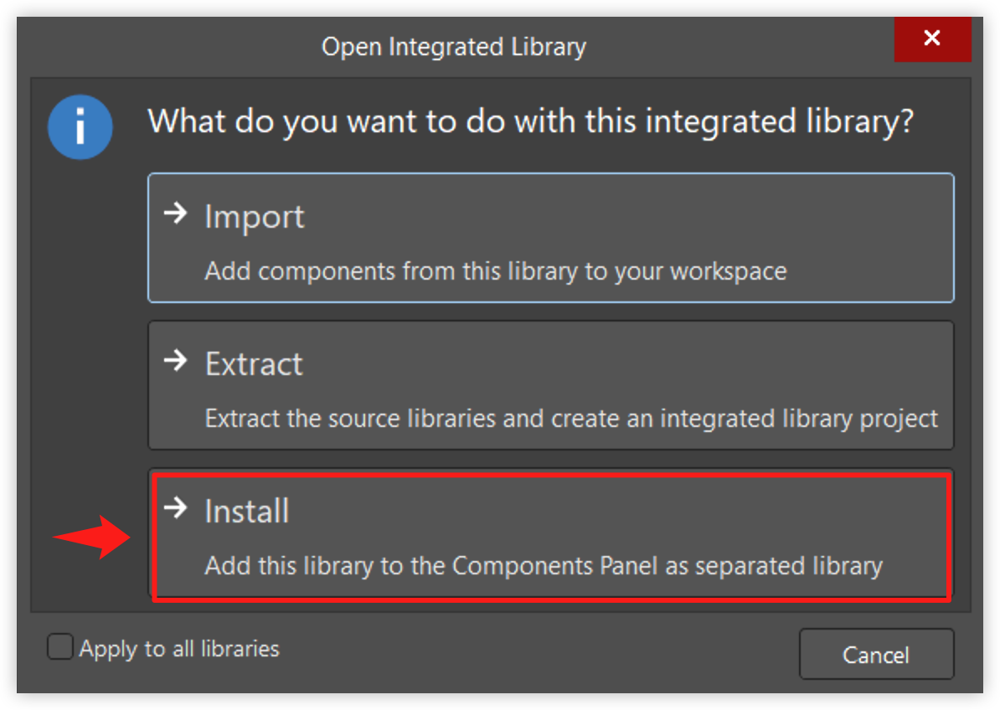
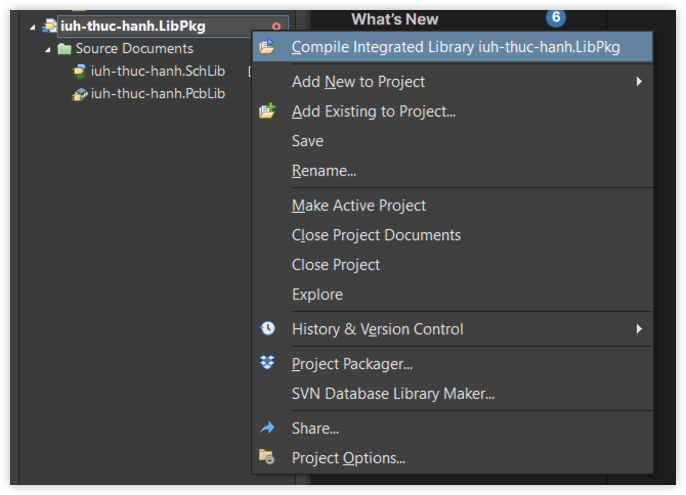

## Thư viện chính

> iuh-thuc-hanh

## Các thư viện khác

> Ở trong folder `other libraries`

## Hướng dẫn

### Thêm thư viện
- Mở file `.IntLib` trong folder `Project Outputs`
- Chọn **Install**

*Một số thư viện sẽ không có file `.IntLib` vì giới hạn dụng lượng của github.*

*Giải pháp: Mở thư viện trong Altium và build*

### Mở và chỉnh sửa thư viện
- Mở file `.PLibPkg`
- Sửa thư viện nguyên lý ở file `.SchLib`
- Sửa thư viện PCB ở file `.PcbLib` 
- Compile thư viện bằng cách chuột phải vào thư viện và chọn **Compile**
